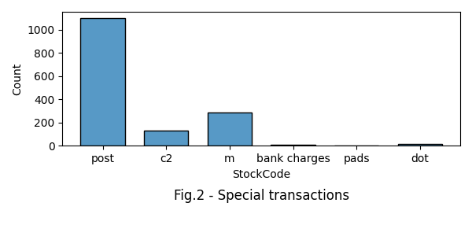
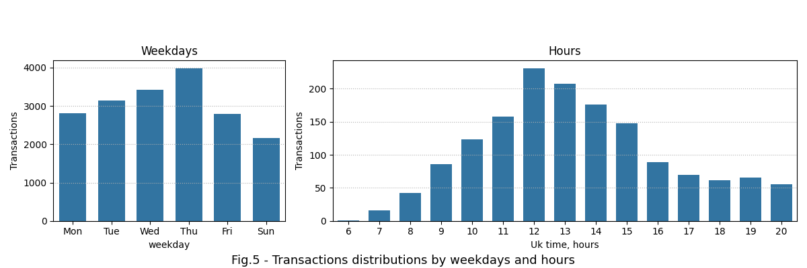
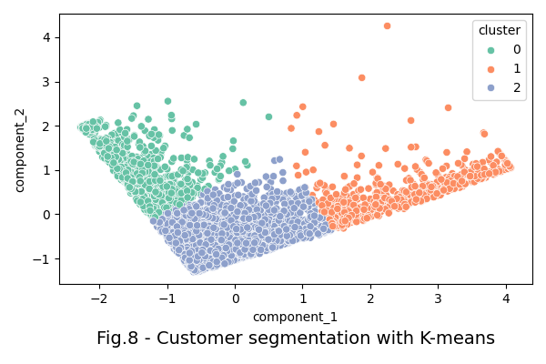
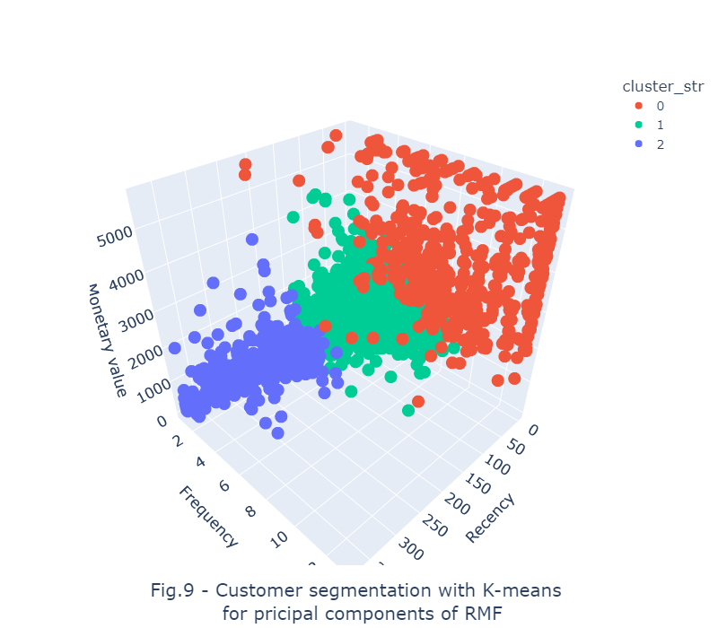

# web_shop_customers_segmentation


## Content

* [Summary](README.md#Summary)  
* [Project description](README.md#Project-description)  
* [Data and methods](README.md#Data-and-methods)
* [Results](README.md#Results) 
* [Project structure](README.md#Project-structure)
* [Tables](README.md#Tables)  

---

## Summary
It was performed customer segmentation using K-means for a UK web retailer. An optimal number of clusters was identified using several metrics: inertia, silhouette coefficient, and the Davis Bouldin score. It was shown that purchases have seasonality by month, weekdays, and hours. 


## Project description
To increase their revenue, companies customize their pricing models for every customer segment. Although these pricing strategies are a fundamental part of any digital company's business models, they may differ over time. Customer segment sizes as well as customers behavior within the segment are subjects of continuous change since they depend on multiple factors such as economy, competitors' prices, perception of goods worth, location, season, and so on. Recent improvements in Artificial Intelligence and Machine learning allow creating of better pricing models that consequently increase competition between online retail platforms. To win this challenge, a company has to identify new customer needs and segments constantly to customize its pricing strategies.

The project is devoted to client segmentation for a UK webshop with several unsupervised clustering algorithms. Segmentation helps to identify common customer behavior patterns and allows to target customers with tailored marketing strategies.  

## Data and methods
The dataset contains about 542,000 different transactions which have been recorded between the years 2010 and 2011. These transactions, however, include canceled purchases which should be deducted to calculate the fair integral value of transactions by customer. As a result, the mean customer value is $21 \pm 68 $ sterlings (fig.1). Meanwhile other [encoded events](https://www.kaggle.com/code/fabiendaniel/customer-segmentation/notebook) (fig.2 , table 1) such as shipment expenditures, bank charges, etc. should not be accounted for because they hinder understanding of the real purchasing power of clients.

 
<div align="center">    </div>

Usually, purchases have seasonality by months, days of the week, and hours which may provide us with precious insights for better clustering. Time marks of every purchase could be extracted from the 'InvoiceDate' feature. Furthermore, this frame allows us to apply the RMF analysis, one of the widely used marketing methods of customer valuation. According to the method, customers could be characterized by: the recency of their last purchase, frequency of purchases, and total monetary value of purchases.

To identify an optimal number of clusters within the given range, it was calculated several metrics such as silhouette score, inertia, and the Davies Bouldin score. The latter shows the extent of feature uniqueness among the clusters, and the lower the score the better. Unlike the Davies Bouldin score, the optimal number of clusters by the inertia and silhouette score is noticeable in case of a remarkable metric change.

## Results
 
Analyzing annual revenue distribution by country, it can be seen that most transactions come from the UK (82 %); customers from the Netherlands and Ireland generate about 3% each, and other countries return the rest 12 % in total.

<div align="center">   </div>

From the fig.4 which represents monthly revenue distribution by country it can be inferred the following:
* **the UK**: integral monthly revenue is constantly growing within the year whereas the mean revenue is stable.
* **the Netherlands**: revenue volume remains stable within the year except in April and July when it falls to almost 0. On the other hand, mean monthly revenue grows from January to April from 120 to 140 pounds respectively; within the next 2 months, it is sharply declining to almost zero though since August it returns to fluctuating around 130 sterlings.
* **Ireland**: mean revenue is fluctuating around 30 pounds within the year except for January and July when it increases 4 and 2 times respectively.  
* **France and Germany**: integral and mean revenue trends do not change significantly within the year.

<div align="center">   </div>

Analyzing seasonality by weekday it can be seen that number of daily transactions gradually increases from over 2000 on Sundays to 4000 on Thursdays (which gives 0.75 and 1.9 million pounds in revenue respectively) and drops below 3000 (1.24 million pounds in revenue) on Fridays (fig.5 left). Saturday revenues are not shown in the dataset which probably means either the website or its partnering bank doesn't transfer money on these days.

The average number of transactions starts from 1 transaction at 6h00 (the UK timezone) and constantly increases every hour until 12h00 when it reaches about 250 events; though within the next 5 hours, the intensity of transactions is declining gradually to 75 and then remains stable until 21h00. Transactions in the late evening and night are absent in the dataset.

<div align="center">   </div>

To get better clustering results and use a maximum of information, values, and outliers, exceeding 0.95 quantiles were replaced with that boundary. Thus 4329 unique clients were evaluated as shown in the Fig.6:
* the mean monetary value is $1266 \pm 1476$ pounds which highlights the customers' tendency to do relatively expensive purchases. Wide standard deviation implies that customers can be spread by at least 2 groups: low-value and high-value clients. The latter group might consist of commercial companies whereas the former might contain more private individual clients.
* frequency of purchases varies from 1 to more than 10 events per year. It indicates that customers have a propensity to buy products frequently rather than seldom. 
* recency shows the minimal number of days between December 10th and the last client's visit. Half of customers did the purchase within the last 2 months. On the other hand, the mean time lag is about 100 days which proves the popularity of the webshop.

<div align="center">   </div>

Comparing the clustering metrics by the number of clusters (Fig.7) it was found, that splitting the customers'  population into 3 parts would be the best option because of two main reasons: 
* this gives maximal uniqueness of customer features 
* further split doesn't lead to better clustering results

<div align="center">   </div>

After calculating the optimal number of splits, the k-means algorithm provides with following segments as shown in the Fig.8:
* <span style="color:red">**loyalists**</span> - contains 701 clients with high monetary returns and purchasing frequencies. This segment comprises the most precious clients, generating a decent part of the sales revenue. Most of them did their purchases within the last 2 months. Low cluster density by frequency and monetary value axes indicates substantially different customer behaviors: some of them buy quarterly and even monthly; others spend over 2,000 pounds. A possible strategy would be to retain these customers.
* <span style="color:blue">**newcomers**</span> is of 1056 customers, who occasionally purchased goods via the platform more than a half year ago say, at the end of 2010th year. Although these clients spent on average $4060 \pm 1388$ pounds, they should be engaged more. This could be done, for instance, by direct emails, suggesting supplement goods for their past purchases. 
* <span style="color:green">**dormants segment**</span> of 2572 clients is the most populated. These clients purchased goods within the last half of the year. Since their mean revenue is $854 \pm 854$ pounds, it would be suggested to provide them with discounts by volume.

<div align="center">   </div>

Common customer profiles by segments could be also conceived from a spider-web diagram as shown in Fig.9:
* <span style="color:red">**loyalists**</span> consist of the most engaged and profitable customers 
* <span style="color:blue">**newcomers**</span> is the least developed segment, exploring the service
* <span style="color:green">**dormants**</span> well-develloped segment of customers who purchase frequently.
 
 

<div align="center">   </div>

## Project structure

<details>
  <summary>display project structure </summary>


```Python
web_shop_customers_segmentation
├── .git
├── .gitignore
├── config
│   └── config.json         # configuration parameters
├── data                    # data archive
│   └── webshop_data.zip  
├── figures                 # images storage
│   ├── fig_1.png
.....
│   └── fig_9.png
├── LICENSE
├── models                  # models storage
├── notebooks               # project notebooks storage
│   └── webshop_segmentation.ipynb
├── project tree.ipynb
├── README.md
└── utils                   # custom functions and applications
    ├── config_reader.py
    └──  functions.py
    

```
</details>

## Tables

<details>
  <summary>Table 1.  statuses</summary>

|code| status |
|:-- | :-- |
| POST| POSTAGE  |
| C2  | shipment costs |
| M   | Manual   |
| BANK CHARGES|Bank Charges   |
| PADS | PADS TO MATCH ALL CUSHIONS |   
| DOT  | DOTCOM POSTAGE |
| D    | Discount       | 

</details>