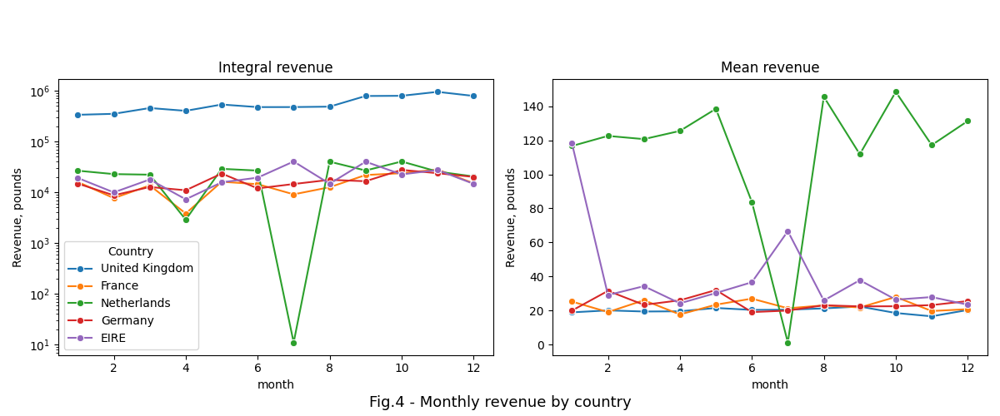

# web_shop_customers_segmentation


## Content

* [Summary](README.md#Summary)  
* [Project description](README.md#Project-description)  
* [Data and methods](README.md#Data-and-methods)
* [Results](README.md#Results) 
* [Project structure](README.md#Project-structure)
* [Tables](README.md#Tables)  

---

## Summary
 

## Project description
To increase its revenue, companies customized their pricing models for every customer segment. Although these pricing strategies are a fundamental part of any digital company's business models, they may differ by time. Customer segment sizes as well as customers behavior within the segment are subjects of continuous change since they depends of multiple factors such as: economy, competitors prices, perception of goods worth, location, season, and so on. Recent improvements in Artificial Intelligence an Machine learnig allow to create better pricing models that consequently increases competition between online retail platforms. To win this challenge, a company has to identify new customer needs and segments constantly to 
customize its pricing strategies.

The project is devoted to clients segmentation for an UK web shop  with several unsupervised clustering algorithms. Segmentation helps to identify common customer behavior patterns and allows to target customers with tailored marketing strategies. 

## Data and methods
The dataset contains information about 541909 different transactions which have been recorded between the years 2010 and 2011. These transactions, however, include canceled purchases which should be deducted to calculate fair integral value of transactions by customer. In result, the mean customer value is $21 \pm 68 $ sterlings (fig.1). Meanwhile other [encoded events](https://www.kaggle.com/code/fabiendaniel/customer-segmentation/notebook) (fig.2 , table 1) such as shipment expenditures, bank charges, and etc. should not be accounted because they hinder understanding of real purchasing power of clients.

 
<div align="center">    </div>


Analyzing customer revenue distribution by country it can be seen that most transactions are from the UK (82 %); customers from the Netherlands and Ireland generate about 3% each, and other countries returns about 12 % in total.

<div align="center">   </div>

Analyzing monthly revenue by country (fig.4) it can be inferred as follows:
* **the UK**: integral monthly revenue is constantly growing within the year whereas the mean revenue is stable.
* **the Netherlands**: revenue volume remains stable within the year except April and July, when it dropps to almost 0. On the other hand, mean monthly revenue grows from January to April from 120 to 140 pounds respectively; within the next 2 months it is sharply declining to almost zero though since August it returns to fluctuating around 130 sterlings.
* **Ireland**: mean revenue is fluctuating around 30 pounds within the year except January and July when it increases in 4 and 2 times respectively.  
* **France and Germany**: integral and mean revenue trends doesn't change significantly within the year.

<div align="center">   </div>

Analyzing seasonality by weekday it can be seen that number of daily transactions gradually increases from over 2000 in Sunday to 4000 in Thursday (which gives 0.75 and 1.9 million pounds in revenue respectively) and dropps below 3000 (1.24 million pounds in revenue) on Fridays (fig.5 left). Saturday's revenues are not shown in the dataset which probably means the partnering bank doesn't transfer money that day or the these days are excluded intentionally.
Average number of transactions by the UK timezone starts from 1 transaction at 6h00 and constantly increases every hour untill 12h00 when it reah about 250 events; though within the next 5 hours the transactions intensity is declining gradually to 75 and then remains stable untill 21h00. Transactions in the late evening and night are absent in the dataset.

<div align="center">   </div>


## Results
 


## Project structure

<details>
  <summary>display project structure </summary>


```Python
web_shop_customers_segmentation
├── .git
├── .gitignore
├── config
│   └── config.json         # configuration parameters
├── data                    # data archive
│   └── webshop_data.zip  
├── figures                 # images storage
│   ├── fig_1.png
.....
│   └── fig_6.png
├── LICENSE
├── models                  # models storage
├── notebooks               # project notebooks storage
│   └── webshop_segmentation.ipynb
├── project tree.ipynb
├── README.md
└── utils                   # custom functions and applications
    ├── config_reader.py
    └──  functions.py
    

```
</details>

## Tables

<details>
  <summary>Table 1.  statuses</summary>

|code| status |
|:-- | :-- |
| POST| POSTAGE  |
| C2  | shipment costs |
| M   | Manual   |
| BANK CHARGES|Bank Charges   |
| PADS | PADS TO MATCH ALL CUSHIONS |   
| DOT  | DOTCOM POSTAGE |
| D    | Discount       | 

</details>